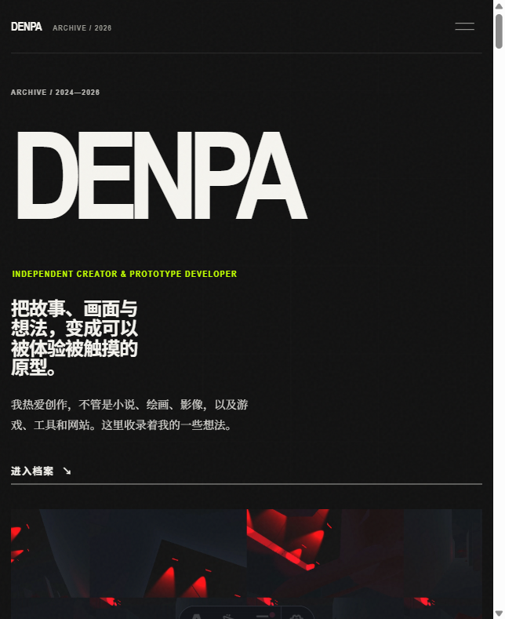
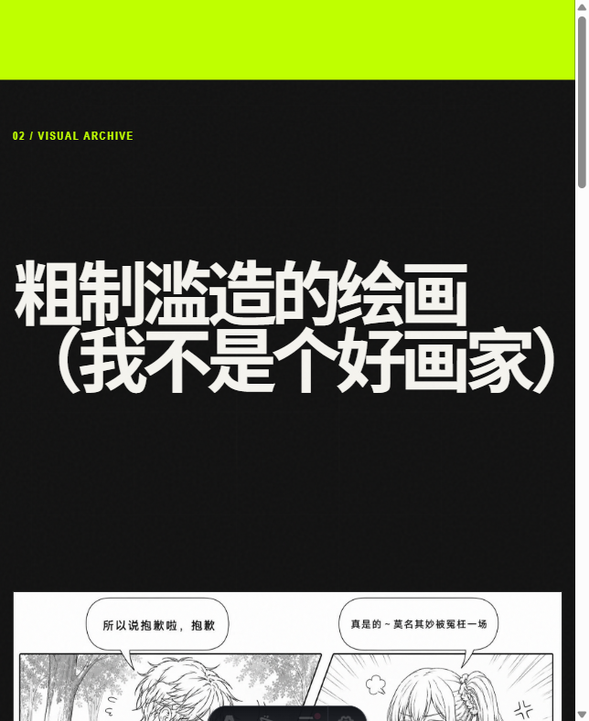
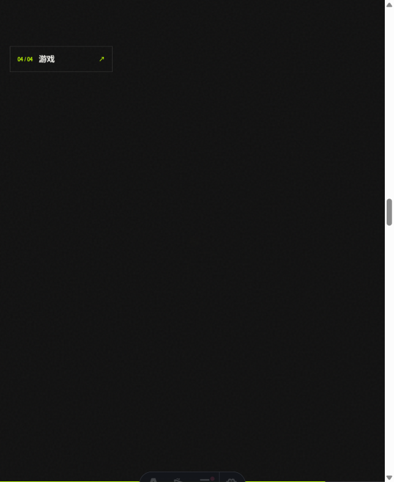
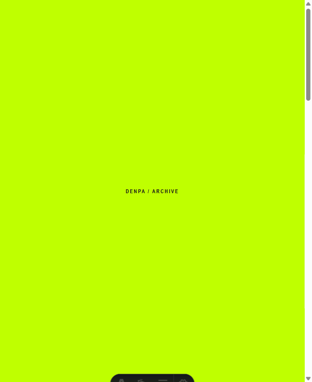
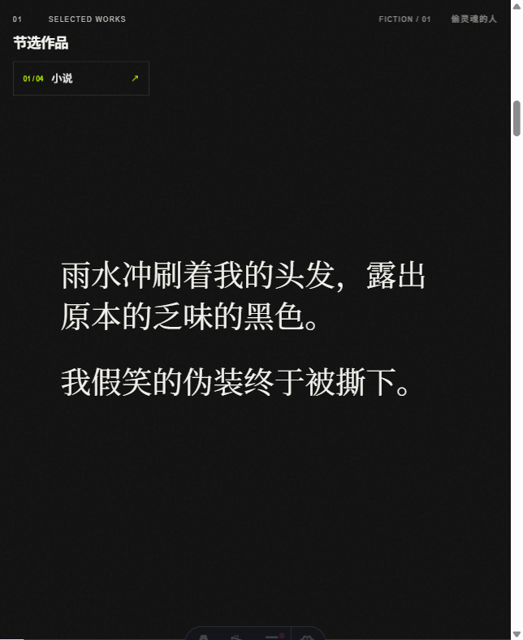

# DENPA — Digital Art Archive

融合小说、绘画、实验影像与独立游戏的互动数字艺术作品集。

## 项目简介

DENPA 是一个原创数字艺术档案站，收录了创作者在小说、绘画、实验短片和独立游戏四个方向的原创作品。网站以连续滚动叙事为核心体验，每个作品板块既独立成章，又在视觉节奏上彼此呼应。

项目由创作者独立完成概念策划、视觉方向、交互设计、需求拆解、AI 协作、验收与部署。

## 核心体验

- **连续叙事首页**：从个人介绍到作品展示，一次滚动完成全站导览
- **小说阅读**：支持明暗主题切换和阅读进度追踪
- **画作画廊**：键盘可操作的大图浏览模式
- **游戏档案**：以图片画廊形式呈现每个游戏项目
- **响应式排版**：桌面端强调编辑排版风格，移动端保持清晰可读

## 截图预览

| 画作 | 游戏 |
|------|------|
|  |  |

| 小说 | 首页内容 |
|------|----------|
|  |  |

## 技术栈

- **[Astro 5](https://astro.build/)** — 静态站点生成框架
- **[GSAP](https://gsap.com/)** — 滚动动画与时间轴控制
- **[Lenis](https://lenis.studio/)** — 平滑滚动
- **SCSS** — 样式与响应式排版
- **TypeScript** — 类型安全
- **pnpm** — 包管理
- **Cloudflare Pages** — 静态部署

## 开发过程

整个项目从零开始，经历了以下阶段：

1. **需求与概念**：确定"数字艺术档案"的定位和四个作品方向
2. **视觉研究**：参考编辑排版风格，确定深色主题和排版节奏
3. **技术选型**：选择 Astro + GSAP + Lenis 实现静态站点与滚动动画
4. **迭代开发**：首页连续叙事、小说明暗切换、画作大图浏览、游戏画廊
5. **素材接入**：将原创作品（小说文本、画作、影片、游戏截图）全部替换模拟数据
6. **响应式调试**：覆盖 320px 至 1920px 共 143 种尺寸验证
7. **部署上线**：构建静态 dist 并上传至 Cloudflare Pages

## AI 辅助开发说明

本项目使用 AI 编程工具辅助开发。AI 在以下方面提供了支持：

- 代码生成与技术选型建议
- 响应式样式实现与调试
- 构建配置与部署流程
- 素材格式转换（图片 WebP 转换等）

**创作者独立负责的部分：**

- 全部原创内容（小说文本、绘画作品、实验影片、游戏设计）
- 概念策划与视觉方向
- 交互设计与用户体验决策
- 需求拆解与验收标准
- 最终部署与上线

## 本地运行

需要 Node.js 20 或更新版本。

`ash
pnpm install
pnpm run dev
`

浏览器打开终端显示的本地地址，通常是 `http://localhost:4321`。

也可以双击项目根目录的 `run-local.bat`（Windows）直接启动。

## 构建

`ash
pnpm run check   # Astro 类型检查
pnpm run build    # 生成静态文件到 dist/
`

构建成功后，最终静态文件位于 `dist/` 目录，可直接部署到 Cloudflare Pages 或其他静态托管服务。

## 项目结构

`	ext
src/
  content/          # 内容数据（profile、novels、artworks、videos、games）
  layouts/          # 页面基础布局
  pages/            # 路由页面
  styles/           # 全局与模块样式
public/
  media/            # 实际网页素材（图片、视频）
docs/               # 项目文档与截图
dist/               # 构建输出（git 忽略）
`

## 项目状态

- 当前版本：v1.0
- 部署状态：已通过 Cloudflare Pages Direct Upload 上线
- 维护状态：活跃，持续更新作品

## 内容维护

内容数据集中在以下文件：

`	ext
src/content/profile.json    # 个人资料与联系方式
src/content/novels.json     # 小说数据
src/content/artworks.json   # 画作数据
src/content/videos.json     # 视频数据
src/content/games.json      # 游戏数据
`

实际网页素材位于 `public/media/`。详细更新方法见 [HOW_TO_UPDATE.md](HOW_TO_UPDATE.md)。

## 设计参考

网站研究了 wodniack.dev 的编辑排版和创意开发节奏，但没有复制其源码、素材、文案、页面结构或独特视觉表达。详细记录见 [docs/DESIGN_REFERENCE.md](docs/DESIGN_REFERENCE.md)。

## License

All original content (novels, artworks, videos, games) is copyright of the creator. All rights reserved.